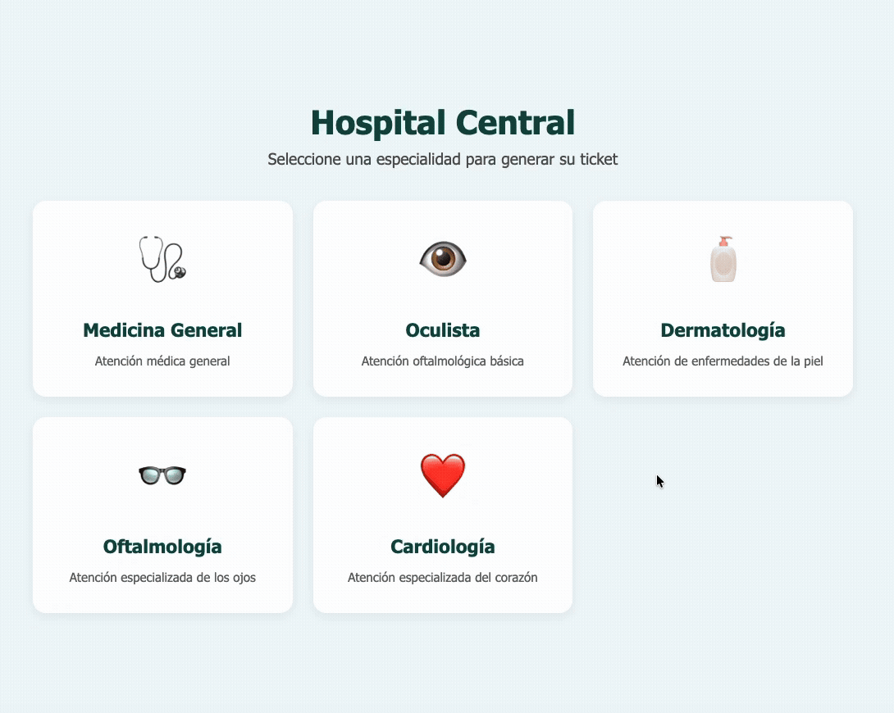
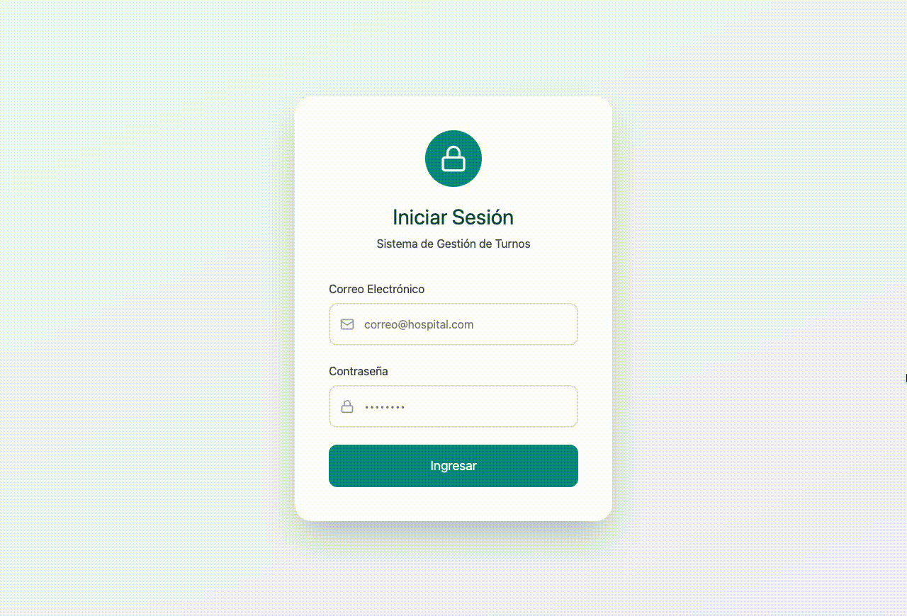
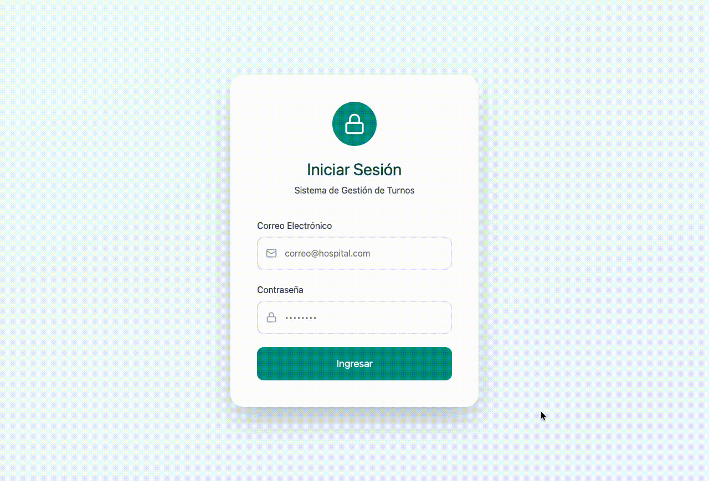

# Clinic Queue System

### About project

Web-based clinic queue system. The system allows patients to request attention tickets for one of five medical specialties — Medicina General (General Medicine), Oculista (Optometrist), Dermatología (Dermatology), Oftalmología (Ophthalmology) and Cardiología (Cardiology) — through a self-service kiosk screen. Clinical staff manage the patient flow through a dedicated dashboard where they can call the next patient, mark tickets as attended or cancel them. A real-time waiting room display powered by WebSockets keeps patients informed of which ticket is currently being called at each clinic. Administrators have access to reporting tools that visualize ticket distribution by clinic and by status.

## Table of Contents

- [Stack](#stack)
- [Demo](#demo)
- [License](#license)

## Stack

- Frontend
  - Dashboard: `Angular`
  - Kiosk: `HTML, CSS, JS`
  - Queue: `HTML, CSS, JS`
- Backend: `Golang`
- Database: `Mysql`
- Hosting: `Railway`

## Demo

### Kiosk

### Dashboard (Admin)

### Dashboard (Frontdesk)

## License

This project is open source and available under the MIT License.
